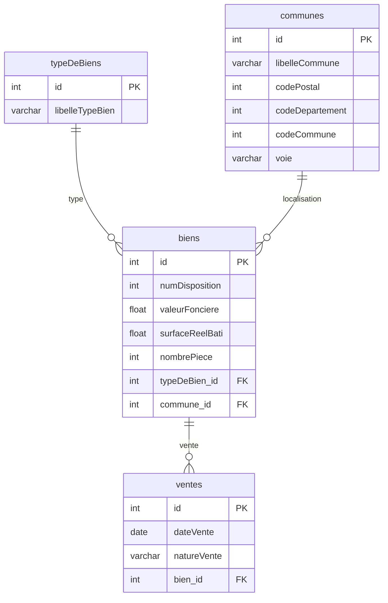

# 🏠 DATAImmo — Base de données immobilière nationale

<div align="center">
    


<div align="center">
  
</div>   

**Conception et implémentation d'une base de données relationnelle pour l'analyse du marché immobilier français**

*Projet réalisé dans le cadre de la formation Data Analyst — OpenClassrooms*

</div>

---

## 📁 Structure du projet

```
📦 DATAImmo_Chouchane_Farid/
├── 📄 README.md
├── 📂 sql/
│   ├── create_tables.sql          # DDL — Création des tables
│   └── requetes.sql               # 12 requêtes métier
├── 📂 livrables/
│   ├── 1_dictionnaire_donnees.xlsx
│   ├── 2_schema_relationnel.pdf
│   ├── 3_captures_bdd/
│   │   ├── table_biens.jpg
│   │   ├── table_communes.jpg
│   │   ├── table_typeDeBiens.jpg
│   │   └── table_ventes.jpg
│   └── 4_requetes_resultats.pdf
└── 📂 data/
    ├── Valeurs_foncieres.xlsx
    ├── donnees_communes.xlsx
    └── referentiel_geographique.xlsx
```

---

## 📋 Sommaire

- [Contexte](#-contexte)
- [Sources de données](#-sources-de-données)
- [Modélisation](#-modélisation)
- [Installation](#-installation)
- [Requêtes SQL](#-requêtes-sql--analyses-métier)
- [Résultats clés](#-résultats-clés)
- [Stack technique](#️-stack-technique)
- [Compétences](#-compétences-démontrées)

---

## 🎯 Contexte

**Laplace Immo**, réseau national d'agences immobilières, souhaite exploiter ses données pour mieux **prévoir les prix de vente** des biens immobiliers. Le projet interne **DATAImmo** consiste à :

1. Concevoir un schéma relationnel normalisé **(3NF)** à partir de sources open data hétérogènes
2. Implémenter et alimenter la base de données sous **MySQL**
3. Répondre à **12 requêtes métier** pour éclairer les décisions stratégiques de la direction

> 📅 Périmètre temporel : **1er semestre 2020** (POC — Proof of Concept)

---

## 📦 Sources de données

| Source | Contenu | Format |
|--------|---------|--------|
| [DVF — data.gouv.fr](https://www.data.gouv.fr/fr/datasets/demandes-de-valeurs-foncieres/) | Transactions immobilières et foncières (Demandes de Valeurs Foncières) | `.csv` |
| [INSEE](https://www.insee.fr) | Recensement de la population par commune | `.xlsx` |
| [Référentiel géographique — data.gouv.fr](https://www.data.gouv.fr) | Communes, départements, régions | `.xlsx` |

---

## 🗂️ Modélisation

### Schéma relationnel (3NF)



### Dictionnaire des données

<details>
<summary><b>Table <code>biens</code></b></summary>

| Champ | Type | Clé | Description | Contrainte |
|-------|------|-----|-------------|-----------|
| `id` | INTEGER | PK | Identifiant unique du bien | NOT NULL · AUTO_INCREMENT |
| `numDisposition` | INTEGER | — | N° de disposition de la mutation | NULL autorisé |
| `valeurFonciere` | FLOAT | — | Valeur foncière du bien (€) | NULL autorisé |
| `prefixeSection` | VARCHAR(255) | — | Préfixe de la section cadastrale | NULL autorisé |
| `section` | VARCHAR(255) | — | Section cadastrale | NULL autorisé |
| `numPlan` | VARCHAR(255) | — | Numéro de plan cadastral | NULL autorisé |
| `surfaceReelBati` | FLOAT | — | Surface réelle bâtie (m²) | NULL autorisé |
| `nombrePiece` | INTEGER | — | Nombre de pièces principales | NULL autorisé |
| `typeDeBien_id` | INTEGER | FK | Référence vers `typeDeBiens` | REFERENCES typeDeBiens(id) |
| `commune_id` | INTEGER | FK | Référence vers `communes` | REFERENCES communes(id) |

</details>

<details>
<summary><b>Table <code>communes</code></b></summary>

| Champ | Type | Clé | Description |
|-------|------|-----|-------------|
| `id` | INTEGER | PK | Identifiant unique AUTO_INCREMENT |
| `numVoie` | INTEGER | — | Numéro de voie |
| `libelle01` | VARCHAR(255) | — | Libellé de voie (complément 1) |
| `libelle02` | VARCHAR(255) | — | Libellé de voie (complément 2) |
| `typeVoie` | VARCHAR(255) | — | Type de voie (RUE, AV, BD…) |
| `codeVoie` | VARCHAR(255) | — | Code Fantoir de la voie |
| `voie` | VARCHAR(255) | — | Nom de la voie |
| `codeIdCommune` | INTEGER | — | Code identifiant commune |
| `codePostal` | INTEGER | — | Code postal |
| `libelleCommune` | VARCHAR(255) | — | Nom de la commune |
| `codeDepartement` | INTEGER | — | Code du département |
| `codeCommune` | INTEGER | — | Code INSEE de la commune |

</details>

<details>
<summary><b>Table <code>ventes</code></b></summary>

| Champ | Type | Clé | Description |
|-------|------|-----|-------------|
| `id` | INTEGER | PK | Identifiant unique AUTO_INCREMENT |
| `dateVente` | DATE | — | Date de la transaction |
| `natureVente` | VARCHAR(255) | — | Nature de la mutation |
| `bien_id` | INTEGER | FK | Référence vers `biens` |

</details>

<details>
<summary><b>Table <code>typeDeBiens</code></b></summary>

| Champ | Type | Clé | Description |
|-------|------|-----|-------------|
| `id` | INTEGER | PK | Identifiant unique AUTO_INCREMENT |
| `libelleTypeBien` | VARCHAR(255) | — | Type de bien (Appartement, Maison…) |

</details>

---

## ⚙️ Installation

### Prérequis
- MySQL 8.0+
- HeidiSQL ou MySQL Workbench

### 1. Créer la base de données

```sql
CREATE DATABASE laplaceimmo CHARACTER SET utf8mb4 COLLATE utf8mb4_unicode_ci;
USE laplaceimmo;
```

### 2. Créer les tables

```sql
CREATE TABLE IF NOT EXISTS typeDeBiens (
    id              INTEGER AUTO_INCREMENT PRIMARY KEY NOT NULL,
    libelleTypeBien VARCHAR(255) NOT NULL
);

CREATE TABLE IF NOT EXISTS communes (
    id              INTEGER AUTO_INCREMENT PRIMARY KEY NOT NULL,
    numVoie         INT,
    libelle01       VARCHAR(255),
    libelle02       VARCHAR(255),
    typeVoie        VARCHAR(255),
    codeVoie        VARCHAR(255),
    voie            VARCHAR(255),
    codeIdCommune   INT,
    codePostal      INT,
    libelleCommune  VARCHAR(255),
    codeDepartement INT,
    codeCommune     INT
);

CREATE TABLE IF NOT EXISTS biens (
    id              INTEGER AUTO_INCREMENT PRIMARY KEY,
    numDisposition  INT,
    valeurFonciere  FLOAT,
    prefixeSection  VARCHAR(255),
    section         VARCHAR(255),
    numPlan         VARCHAR(255),
    surfaceReelBati FLOAT,
    nombrePiece     INT,
    typeDeBien_id   INTEGER,
    FOREIGN KEY (typeDeBien_id) REFERENCES typeDeBiens(id),
    commune_id      INTEGER,
    FOREIGN KEY (commune_id) REFERENCES communes(id)
);

CREATE TABLE IF NOT EXISTS ventes (
    id          INTEGER AUTO_INCREMENT PRIMARY KEY,
    dateVente   DATE,
    natureVente VARCHAR(255),
    bien_id     INTEGER,
    FOREIGN KEY (bien_id) REFERENCES biens(id)
);
```

### 3. Charger les données

Les données brutes ont été nettoyées et restructurées via **Excel / Power Query** pour correspondre au schéma relationnel, puis importées table par table via HeidiSQL.

**Étapes de préparation (Power Query) :**
1. Suppression des colonnes inutiles du fichier DVF brut
2. Séparation des données en 4 tables distinctes (biens, communes, ventes, typeDeBiens)
3. Gestion des valeurs nulles sur `valeurFonciere` et `surfaceReelBati`
4. Uniformisation des types (dates au format `YYYY-MM-DD`, codes département en INTEGER)
5. Import CSV table par table dans HeidiSQL

**Vérification après import :**

```sql
-- Contrôle du chargement des 4 tables
SELECT 'biens'        AS "Table", COUNT(*) AS "Nb lignes" FROM biens
UNION SELECT 'communes',    COUNT(*) FROM communes
UNION SELECT 'ventes',      COUNT(*) FROM ventes
UNION SELECT 'typeDeBiens', COUNT(*) FROM typeDeBiens;
```

```sql
-- Vérification de la qualité des données
SELECT COUNT(*)                          AS "Total biens",
       SUM(valeurFonciere IS NULL)       AS "Valeurs foncières nulles",
       SUM(surfaceReelBati IS NULL)      AS "Surfaces nulles",
       COUNT(DISTINCT codeDepartement)   AS "Nb départements couverts",
       COUNT(DISTINCT libelleCommune)    AS "Nb communes distinctes"
FROM biens
JOIN communes ON biens.commune_id = communes.id;
```

---

## 📊 Requêtes SQL — Analyses métier

### Requête 1 — Nombre total d'appartements vendus au S1 2020

```sql
SELECT COUNT(typeDeBien_id) AS "Appartements vendus S1 2020"
FROM biens
WHERE typeDeBien_id = 2;
```
> **Résultat : 31 378 appartements**

---

### Requête 2 — Nombre de ventes par région (S1 2020)

```sql
SELECT codeDepartement      AS "Département",
       COUNT(*)             AS "Nb ventes appartements"
FROM biens
JOIN communes    ON biens.commune_id    = communes.id
JOIN typeDeBiens ON biens.typeDeBien_id = typeDeBiens.id
WHERE libelleTypeBien = 'Appartement'
GROUP BY codeDepartement
ORDER BY 2 DESC;
```

---

### Requête 3 — Proportion des ventes par nombre de pièces

```sql
SELECT nombrePiece AS "Nb pièces",
       COUNT(*)    AS "Nb appartements",
       ROUND(
           (100 * COUNT(*)) / (
               SELECT COUNT(*) FROM biens
               JOIN typeDeBiens ON biens.typeDeBien_id = typeDeBiens.id
               WHERE libelleTypeBien = 'Appartement'
           ), 2
       ) AS "Proportion %"
FROM biens
JOIN typeDeBiens ON biens.typeDeBien_id = typeDeBiens.id
WHERE libelleTypeBien = 'Appartement'
GROUP BY nombrePiece
ORDER BY nombrePiece;
```

| Nb pièces | Nb ventes | Proportion |
|-----------|-----------|-----------|
| 1 | 6 739 | 21,48 % |
| 2 | 9 783 | **31,18 %** |
| 3 | 8 966 | 28,57 % |
| 4 | 4 460 | 14,21 % |
| 5+ | 1 430 | 4,56 % |

---

### Requête 4 — Top 10 départements par prix au m²

```sql
SELECT codeDepartement AS "Département",
       ROUND(AVG(valeurFonciere / surfaceReelBati), 2) AS "Prix moyen m²"
FROM biens
JOIN communes ON biens.commune_id = communes.id
WHERE surfaceReelBati > 0
GROUP BY codeDepartement
ORDER BY 2 DESC
LIMIT 10;
```

| Département | Prix moyen m² |
|-------------|--------------|
| 94 | **13 636 €** |
| 75 | 13 333 € |
| 92 | 7 656 € |
| 78 | 7 272 € |
| 93 | 6 398 € |
| 6  | 6 294 € |

---

### Requête 5 — Prix moyen du m² en Île-de-France

```sql
SELECT ROUND(AVG(valeurFonciere / surfaceReelBati), 2) AS "Prix moyen m² IDF"
FROM biens
JOIN communes ON biens.commune_id = communes.id
WHERE codeDepartement IN (75, 77, 78, 91, 92, 93, 94, 95);
```
> **Résultat : 7 050,48 €/m²**

---

### Requête 6 — Top 10 appartements les plus chers

```sql
SELECT biens.id        AS "ID Bien",
       codeDepartement AS "Département",
       valeurFonciere  AS "Valeur (€)",
       surfaceReelBati AS "Surface m²"
FROM biens
JOIN typeDeBiens ON biens.typeDeBien_id = typeDeBiens.id
JOIN communes    ON biens.commune_id    = communes.id
WHERE libelleTypeBien = 'Appartement'
ORDER BY valeurFonciere DESC
LIMIT 10;
```

---

### Requête 7 — Taux d'évolution des ventes T1 → T2 2020

```sql
WITH
T1 AS (
    SELECT COUNT(*) AS nb FROM ventes
    WHERE dateVente BETWEEN '2020-01-01' AND '2020-03-31'
),
T2 AS (
    SELECT COUNT(*) AS nb FROM ventes
    WHERE dateVente BETWEEN '2020-04-01' AND '2020-06-30'
)
SELECT ROUND((T2.nb - T1.nb) / T1.nb * 100, 2) AS "Évolution %"
FROM T1, T2;
```
> **Résultat : +3,68 %**

---

### Requête 8 — Classement des régions — apparts > 4 pièces

```sql
SELECT codeDepartement AS "Département",
       ROUND(AVG(valeurFonciere / surfaceReelBati), 2) AS "Prix moyen m²"
FROM biens
JOIN communes    ON biens.commune_id    = communes.id
JOIN typeDeBiens ON biens.typeDeBien_id = typeDeBiens.id
WHERE libelleTypeBien = 'Appartement'
  AND nombrePiece > 4
  AND surfaceReelBati > 0
GROUP BY codeDepartement
ORDER BY 2 DESC;
```

---

### Requête 9 — Communes avec ≥ 50 ventes au T1 2020

```sql
SELECT libelleCommune  AS "Commune",
       codeDepartement AS "Département",
       COUNT(*)        AS "Nb ventes T1"
FROM ventes
JOIN biens    ON biens.id    = ventes.bien_id
JOIN communes ON communes.id = biens.commune_id
WHERE dateVente BETWEEN '2020-01-01' AND '2020-03-31'
GROUP BY libelleCommune, codeDepartement
HAVING COUNT(*) >= 50
ORDER BY 3 DESC;
```

---

### Requête 10 — Écart de prix m² entre 2 pièces et 3 pièces

```sql
WITH
T2P AS (
    SELECT AVG(valeurFonciere / surfaceReelBati) AS prix
    FROM biens JOIN typeDeBiens ON biens.typeDeBien_id = typeDeBiens.id
    WHERE libelleTypeBien = 'Appartement' AND nombrePiece = 2
),
T3P AS (
    SELECT AVG(valeurFonciere / surfaceReelBati) AS prix
    FROM biens JOIN typeDeBiens ON biens.typeDeBien_id = typeDeBiens.id
    WHERE libelleTypeBien = 'Appartement' AND nombrePiece = 3
)
SELECT
    ROUND(T2P.prix) AS "Prix m² 2P",
    ROUND(T3P.prix) AS "Prix m² 3P",
    ROUND((T2P.prix - T3P.prix) / T2P.prix * 100, 2) AS "Écart %"
FROM T2P, T3P;
```
> **Résultat : 4 928 € vs 4 285 € → écart de 13,05 %**

---

### Requête 11 — Top 3 communes — dépts 6, 13, 33, 59, 69

```sql
-- Vue pour le département 6 (répéter pour les autres)
CREATE VIEW moyvalfon6 AS
SELECT codeDepartement, libelleCommune,
       ROUND(AVG(valeurFonciere), 2) AS "Moyenne valeurs foncières"
FROM ventes
JOIN biens    ON biens.id    = ventes.bien_id
JOIN communes ON communes.id = biens.commune_id
WHERE codeDepartement = 6
GROUP BY libelleCommune
ORDER BY 3 DESC
LIMIT 3;

-- Union des 5 vues triée par valeur décroissante
SELECT * FROM moyvalfon6
UNION SELECT * FROM moyvalfon13
UNION SELECT * FROM moyvalfon33
UNION SELECT * FROM moyvalfon59
UNION SELECT * FROM moyvalfon69
ORDER BY `Moyenne valeurs foncières` DESC;
```

| Dépt | Commune | Moyenne valeurs foncières |
|------|---------|------------------------|
| 69 | Lyon 2ème | **455 217 €** |
| 6 | Nice | 273 715 € |
| 33 | Bordeaux | 253 232 € |
| 59 | Lille | 206 779 € |
| 13 | Marseille 2ème | 152 732 € |

---

### Requête 12 — Top 20 communes — transactions / 1000 hab (> 10 000 hab)

```sql
SELECT libelleCommune  AS "Commune",
       codeDepartement AS "Département",
       COUNT(*)        AS "Nb transactions",
       population      AS "Population",
       ROUND(COUNT(*) / population * 1000, 2) AS "Transactions / 1000 hab"
FROM ventes
JOIN biens    ON biens.id    = ventes.bien_id
JOIN communes ON communes.id = biens.commune_id
WHERE population > 10000
GROUP BY libelleCommune, codeDepartement, population
ORDER BY 5 DESC
LIMIT 20;
```

> ⚠️ La colonne `population` n'a pas été intégrée dans le périmètre 
> de ce POC. Cette requête est fonctionnelle mais nécessite l'ajout 
> des données de population INSEE dans la table `communes`.

---

## 📈 Résultats clés

| KPI | Valeur |
|-----|--------|
| 🏠 Appartements vendus S1 2020 | **31 378** |
| 💰 Prix moyen m² en Île-de-France | **7 050 €** |
| 🏆 Département le plus cher | **94 — Val-de-Marne (13 636 €/m²)** |
| 📈 Évolution ventes T1 → T2 | **+3,68 %** |
| 📐 Écart prix m² 2P vs 3P | **13,05 %** |
| 🌆 Nombre de communes avec croissance > 20% | **562** |
| 🥇 Valeur foncière moyenne max | **Lyon 2ème — 455 217 €** |

---

## 🛠️ Stack technique

| Outil | Usage |
|-------|-------|
| **MySQL 8.0** | SGBD relationnel |
| **HeidiSQL 11.3** | Interface de gestion et exécution des requêtes |
| **Excel / Power Query** | Nettoyage et préparation des données |
| **SQL avancé** | CTEs, Vues, UNION, sous-requêtes corrélées |

---

## ✅ Compétences démontrées

- [x] Conception d'un modèle entité-association
- [x] Normalisation jusqu'en 3NF (Troisième Forme Normale)
- [x] Rédaction d'un dictionnaire des données complet
- [x] Création et chargement de tables SQL
- [x] Requêtes SQL complexes (CTEs avec `WITH`, sous-requêtes corrélées)
- [x] Création de vues (`CREATE VIEW`) et opérations `UNION`
- [x] Agrégations et fonctions analytiques (`AVG`, `COUNT`, `ROUND`)
- [x] Communication des résultats à des parties prenantes non-techniques

---

## 👤 Auteur

**Farid Chouchane** — Data Analyst  
Formation Data Analyst · OpenClassrooms

---

<div align="center">
<sub>Données open data — DVF · INSEE · data.gouv.fr · Périmètre : S1 2020 · France métropolitaine</sub>
</div>
